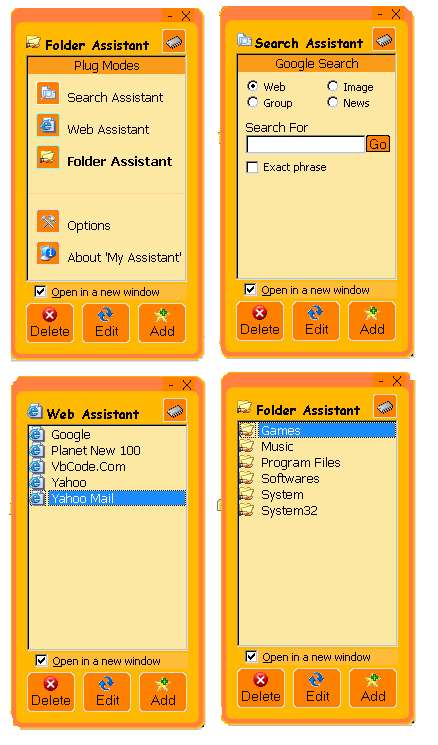



## MyAssistant 2\.3 \- \[Guys\!\!\!,  Meet my assistant\.\. She is cute\!\(?\) \]

### Description

This is an upgraded version of, one of my early build software, which I am using for a long time. Basicaly this is shell executer which can handle WebAddress and Folder Path, listed alphabetically and execute in it's browser. This software is capable of loading on system startup . Current version can also perform advanced google search. Using this software you can save a lot of time specialy when you are working with Internet. Add your freequent visiting sites/folders to the list, dbClick when you need. You have search option for Web/Image/News/Group search. The sotware is a real cute looking one with many trasition effects and a pleasing appearance. The software can be minimized to system tray. The tray icon can also be used to bring the window to top. This will be a good resource for begginers in basics of registry access, file execution, saving/loading information with text files, using system tray.....etc. Enjoy!! and please leave your comments... Jim Jose :-))
 
### More Info
 

             |
---                |---
**Submitted On**   |2005-07-04 14:10:32
**By**             |[JJJJJJJJ](https://github.com/Planet-Source-Code/PSCIndex/blob/master/ByAuthor/jjjjjjjj.md)
**Level**          |Intermediate
**User Rating**    |5.0 (25 globes from 5 users)
**Compatibility**  |VB 6\.0
**Category**       |[Jokes/ Humor](https://github.com/Planet-Source-Code/PSCIndex/blob/master/ByCategory/jokes-humor__1-40.md)
**World**          |[Visual Basic](https://github.com/Planet-Source-Code/PSCIndex/blob/master/ByWorld/visual-basic.md)
**Archive File**   |[MyAssistan190982762005\.zip](https://github.com/Planet-Source-Code/jjjjjjjj-myassistant-2-3-guys-meet-my-assistant-she-is-cute__1-61557/archive/master.zip)

